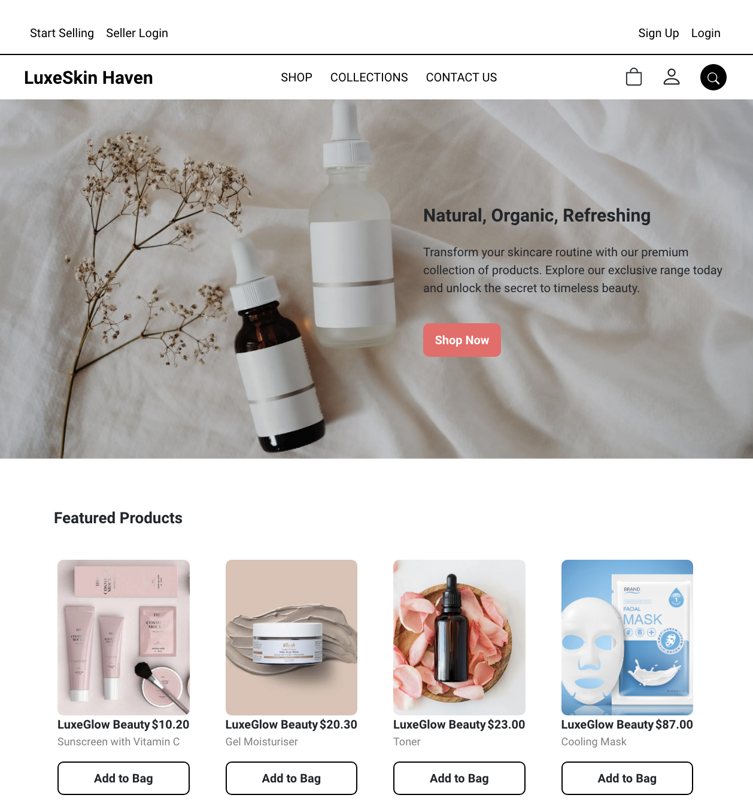
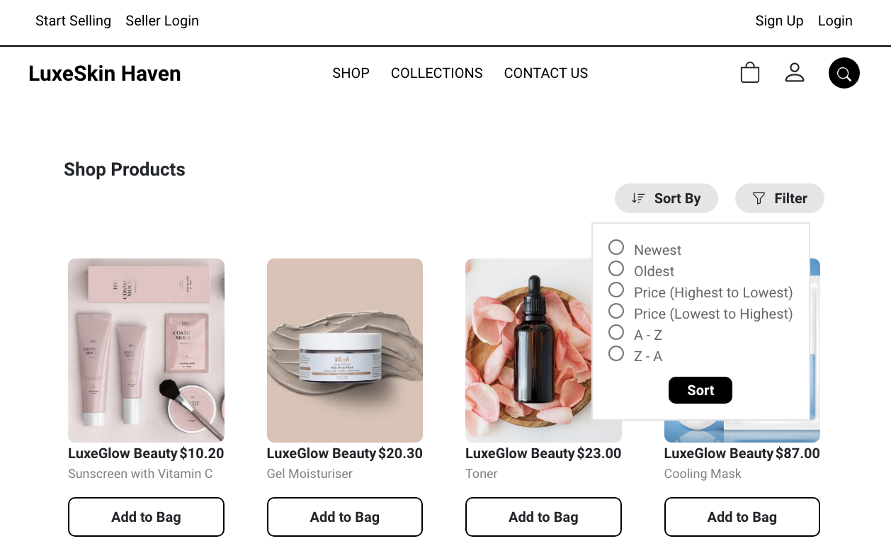
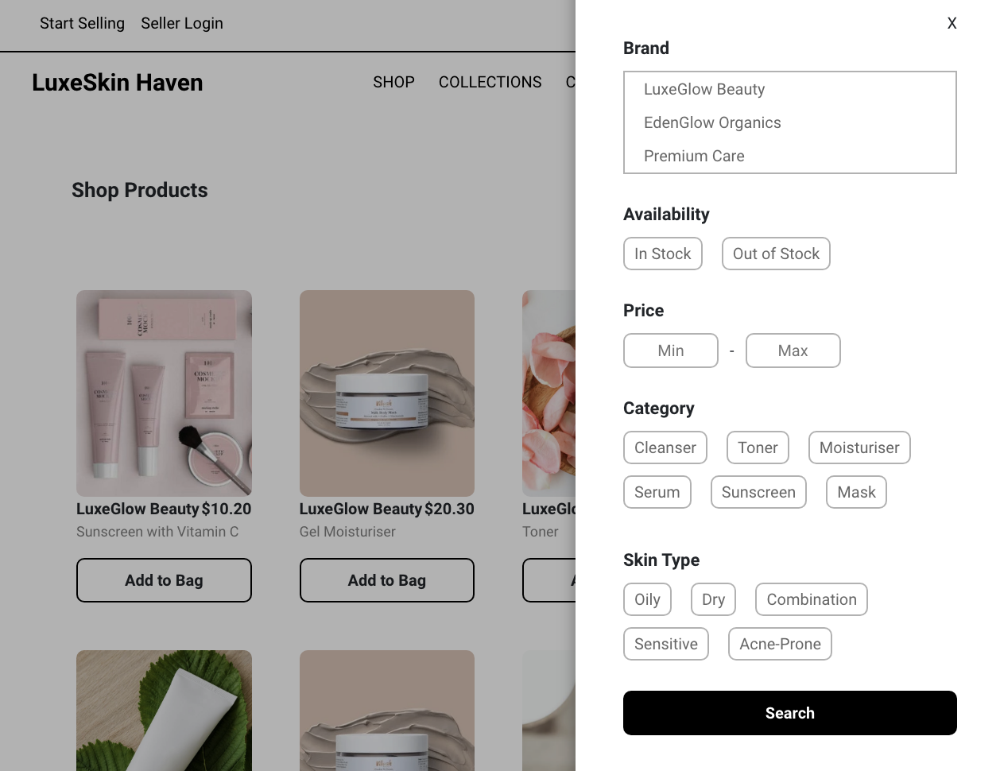
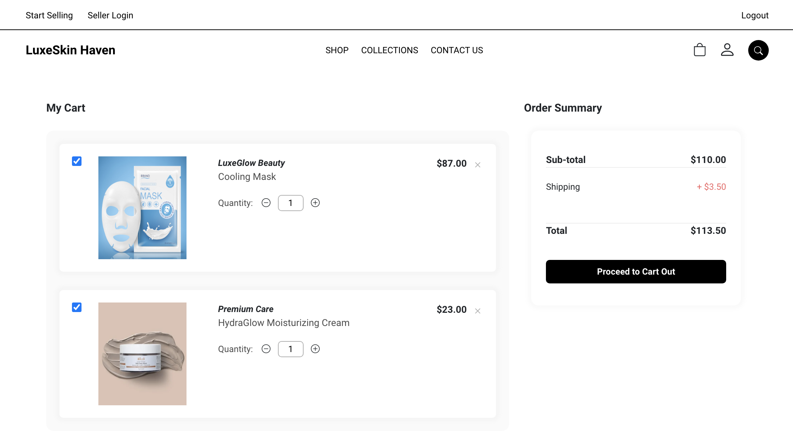
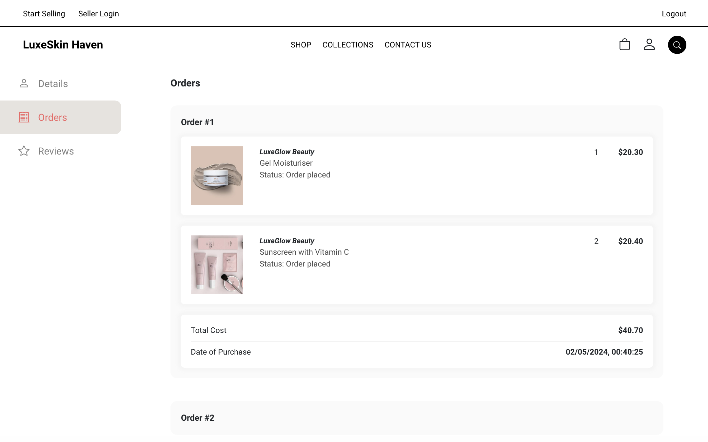
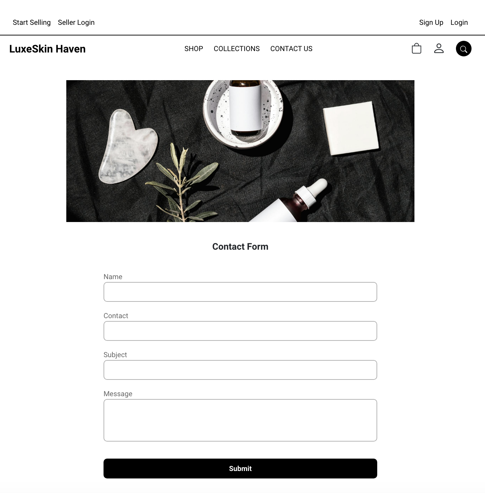
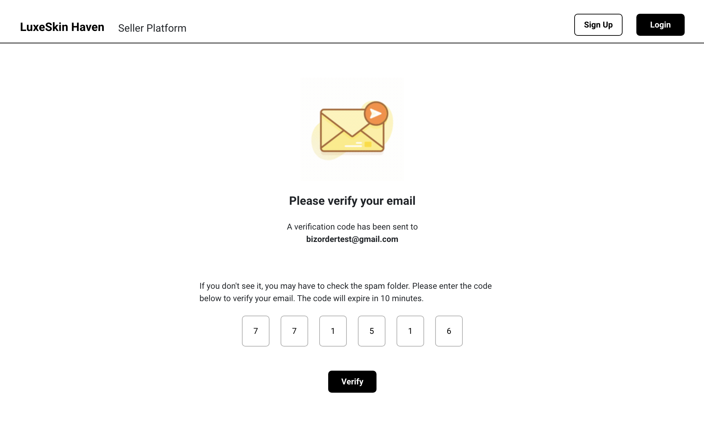
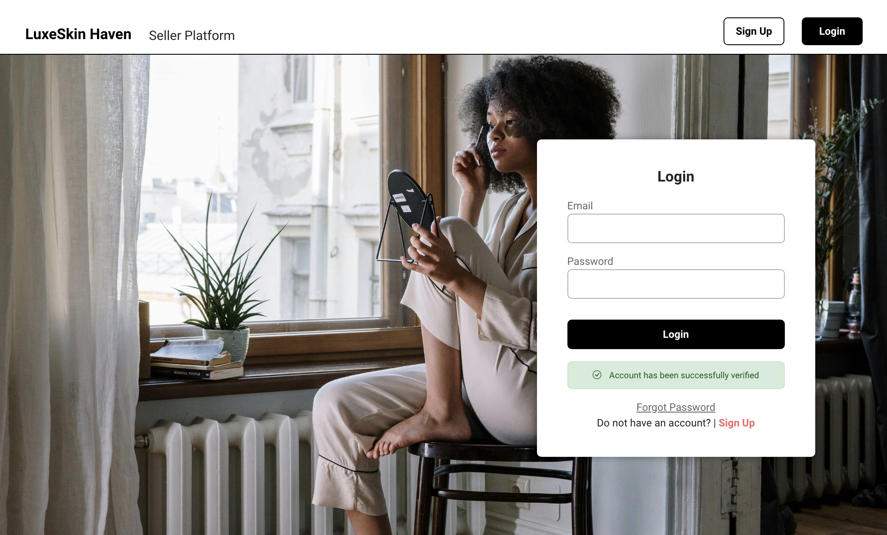
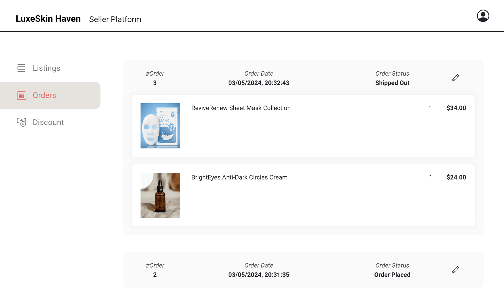

# LuxeSkin Haven

## Project Overview
LuxeSkin Haven is an e-commerce platform dedicated to providing luxurious skincare products to customers seeking high-quality and effective skincare solutions. The platform aims to create a seamless and enjoyable shopping experience for skincare enthusiasts, connecting them with premium skincare brands and products.

- GitHub Repository for Frontend (ReactJS): <a href="https://github.com/christiinelim/luxeskin-haven">Link</a>
- GitHub Repository for Backend (Express, NodeJs, Handlebars, Caolan form, bookshelf ORM): <a href="https://github.com/christiinelim/luxeskin-haven-backend">Link</a>

## Target Audience and Their Pain Points
Our target audience includes skincare enthusiasts who value premium-quality skincare products and desire a convenient and trustworthy platform for purchasing them. Their pain points may include:
- Difficulty finding reliable sources for high-end skincare products.
- Lack of personalized recommendations based on their skin type and concerns.
- Tedious checkout processes and limited payment options.
- Challenges in tracking orders and staying updated on order statuses.

## Structure of Database (SQL Schema)
Here is an overview of the SQL schema:

## Frontend Overview
The user frontend is developed using React, enabling users to browse products, add items to the shopping cart, proceed to checkout using their account, and track order statuses. Here's an example of navigating through the frontend:
1. Home Page: Displays featured products and navigation links.
2. Product Listings: Lists skincare products with details and "Add to Cart" option.
3. Shopping Cart: Shows added items, allows quantity adjustments, and provides checkout option.
4. Checkout: Requires user login, shipping information, and payment details for order confirmation.
5. Order Tracking: Users can track their orders and view current statuses (pending, shipped, delivered).

## Mock-up of Ecommerce Site
**Landing Page**

**Sort Product**

**Filter Product**

**Search Product**

**View Product Page**

**Cart Page**

**Stripe Payment Page**

**Order Page**

**Collections Page**

**Contact Us Page**

## Mock-up of Seller Site
**Seller Sign Up Page**

**Seller Verification Page**

**Seller Login Page**

**Seller Forgot Password Page**

**Seller Reset Password Page**

**Seller Listings Page**

**Seller View Product Page**

**Seller Add Product Page**

**Seller Orders Page**

**Seller Profile Page**

**Seller Delete Account Page**

## Choice of Colors, Fonts, Style of Image, and Layout
LuxeSkin Haven adopts a clean and elegant design with a color palette of soft pastels to convey a sense of luxury and tranquility. The fonts are chosen for readability and modern appeal, while images reflect the premium quality and effectiveness of skincare products. The layout is intuitive, focusing on showcasing products effectively and facilitating smooth navigation.

## User Stories
1. As a skincare enthusiast, I want to browse a curated selection of high-end skincare products tailored to my skin type and concerns.
2. As a seller, I want to easily register, join, list my products, and manage orders, ensuring a seamless experience for buyers.
3. As a buyer, I want to add items to my cart, checkout securely, and track my orders' statuses in real-time.

## Live Links
- [React Frontend](link-to-react-frontend)
- [Backend Admin Dashboard](link-to-backend-admin)

## Technologies Used
- Backend: Express.js, Bookshelf ORM, db-migrate, Stripe, Handlebars (hbs), Caolan form
- Frontend: React, Cloudinary